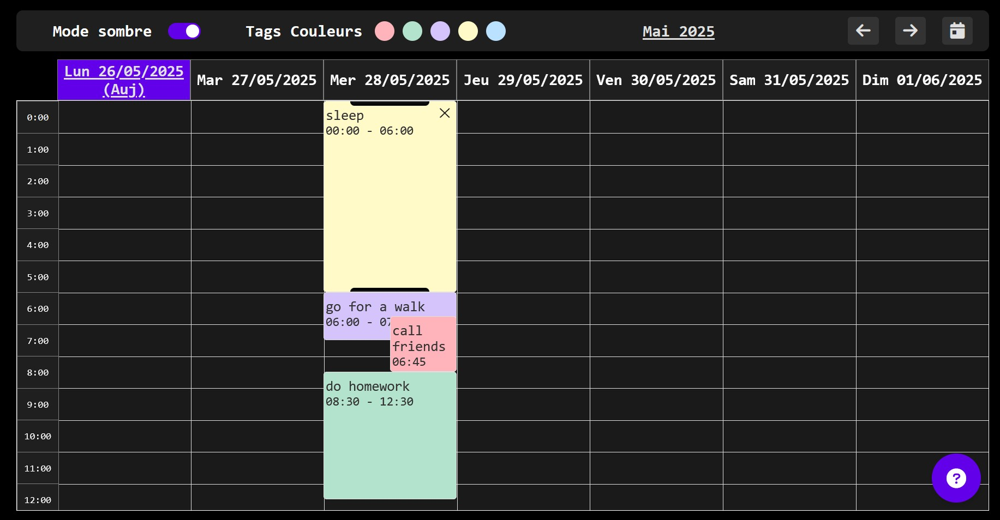
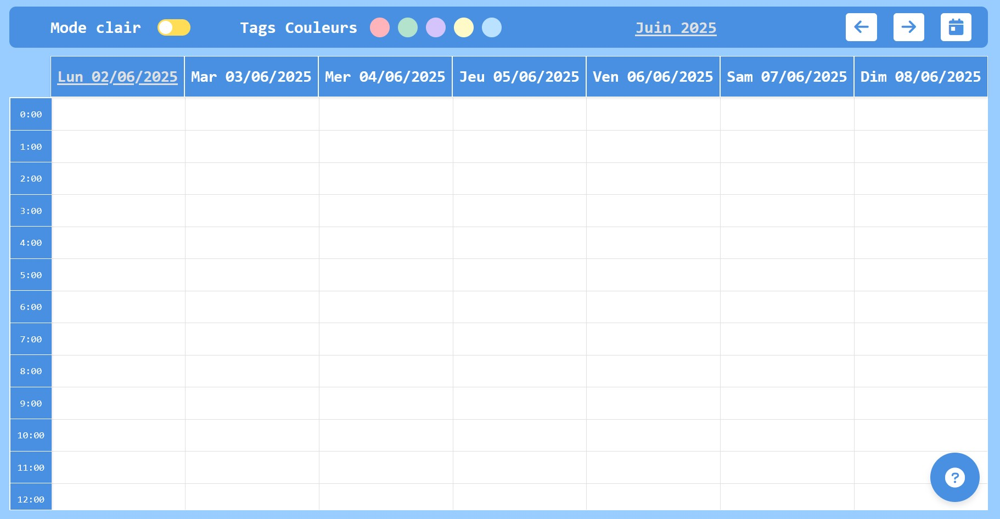
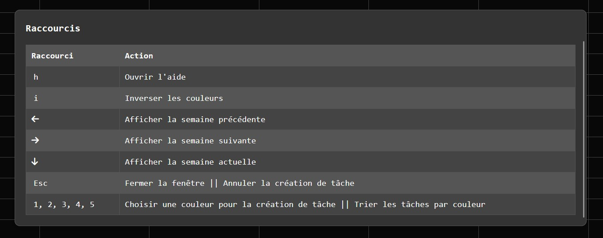

# 📅 Calendrier Web – Gestionnaire de Tâches avec Cookies

## Themes
* Mode sombre

* Mode clair

## Description

Cette application web est un **calendrier interactif** permettant de **gérer vos tâches** quotidiennes. Les tâches sont **stockées localement sous forme de cookies** dans votre navigateur, donc aucune base de données n’est nécessaire.

---

## ✨ Fonctionnalités

* ✅ **Ajout de tâches** directement sur les dates du calendrier
* 🍪 **Stockage des tâches avec des cookies** (localement, sans backend)
* 🌗 **Mode clair / sombre** (thème switchable à tout moment)
* 🎨 **Tags de couleur** pour filtrer l’affichage des tâches par catégorie
* 📅 **Navigation simple** entre les mois avec affichage du nom du mois et de l'année
* ❓ **Bouton d’aide** affichant un tableau avec les **raccourcis clavier** disponibles

---

## 🖥️ Utilisation

* Cliquez sur une date pour **ajouter/modifier une tâche**
* Utilisez les **flèches de navigation** pour changer de mois
* Cliquez sur les **tags de couleur** pour filtrer l’affichage
* Cliquez sur l’icône **"?"** pour voir l’aide et les raccourcis

---

## ⌨️ Raccourcis

---

## 📦 Technologies utilisées

* HTML / CSS / JavaScript
* JavaScript Web Components
* Stockage via **Cookies**
* Pas de backend : tout est géré **localement**

---

## 📍 Avertissements

* Les cookies peuvent être effacés si vous videz le cache de votre navigateur.
* Cette application est conçue pour une **utilisation personnelle** locale.